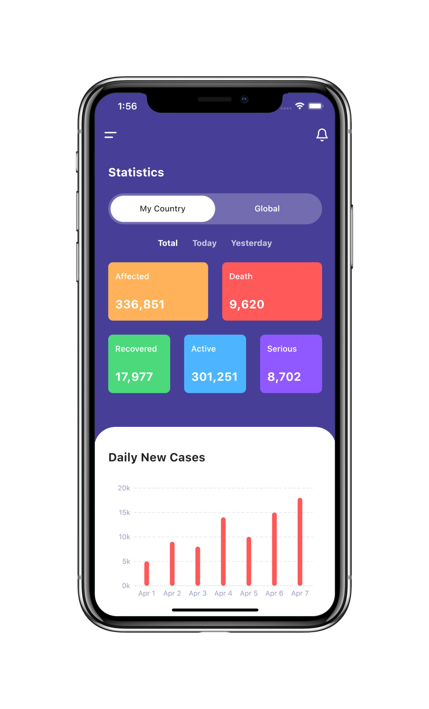

# Flutter UI -  Covid-19 App

[English](README.md)------中文

### 介绍

 新冠疫情数据展示页面

### 视频

YouTube : [观看地址]()

哔哩哔哩 : [观看地址]()

### 设计 

 - 设计者:  Covid-19 App UI Design by [simantOo](https://www.uplabs.com/posts/covid-19-app-a0f11b11-7887-4d6f-b969-08f42d44bec8)

### Covid-19 App 设计稿

### Covid-19 App 最终完成

   

